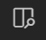
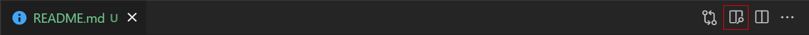

# Info om prosjektet

Info om dette prosjektet er skrevet i mardown - et språk for å lage formatert. I VSCode, når du har denne file åpen, klikk  ikonet på fanevisningen for å navigere mellom sidene.

## Oversikt

- [git](./git.md)
- [GitLab](./gitlab.md)
- [NODE](./node.md)
- [TypeScript](./typescript.md)
- [React](./react.md)
- [NextJS](./nextJS.md)
- [FireBase](./f)
