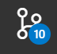
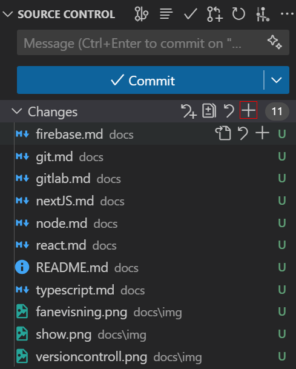
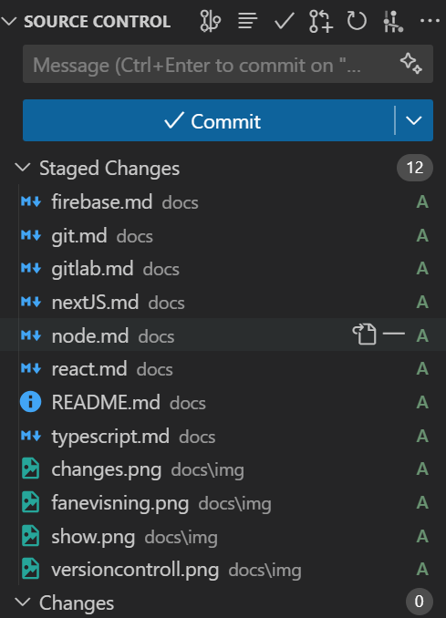
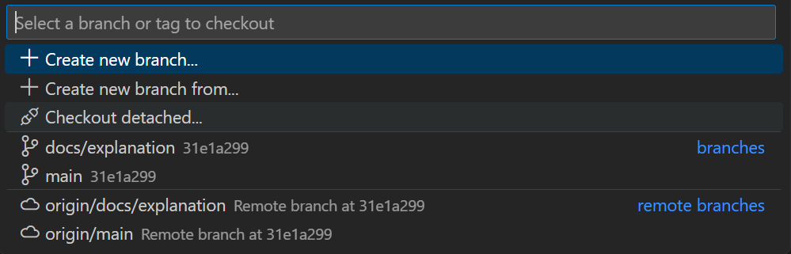

# Grunnleggende om Git

Denne siden handler om git. For GitLab klikk [her](./gitlab.md).

Denne oversikten over git vil **ikke** ta for seg hvordan man bruker git i terminalen. Hvis du er konfortabel med git allerede, trenger du ikke lese denne introduksjonen. Lenke tilbake til oversikten finner du nederst på siden.

Git er et **versjonskontrollsystem** som hjelper deg å spore endringer i koden din.

## Start

Etter alt å dømme har alle instalert git, men det er noen ting en bør sjekke før en starter å endre på prosjektet.
Åpne en terminal og skriv inn;

`git config --global user.name`  
`git config --global user.email`

For hver av disse komandoene burde det bli printet ut et navn for `user.name` og en epost for `user.email`. Hvis det **IKKE** ble det, skriv inn;

`git config --global user.name "<DITT_NAVN>"`  
`git config --global user.email "<DIN_EPOST>"`

der du bytter `<DITT_NAVN>` og `<DIN_EPOST>` (inkludert <>) med ditt ekte navn og NTNU eposten din. Dette er så git og GitLab vet hvem somn gjør hvilke endringer.

## Git med VSCode

### Grunnleggende

VSCode håndterer mye av git for oss, noe som betyr at vi slipper å bry oss om mye av det vi kan kalle **command line git**. I VSCode blir filene automatisk fargekodet etter hva som har skjedd med dem siden sist versjonen på din PC ble dyttet opp til GitLab.

Hvis en trykker på  på sidebaren kan en se alle filene som har endret seg. Tallet viser hvor mage filer som har endret seg.
Filer som har blitt lagd er markert med en grønn U.
Filer som har blitt modifisert er markert med en gyllen/oransj M.
Filer som har blitt slettet er markert med en rød D.

### Dytte filer til GitLab

I  fanen vil du se alle endringene som har skjedd. For å laste opp disse til GitLab må det skje flere ting.

Først må vi **stage** alle endringene. Dette gjør en ved å klikke på pluss ikonet ved siden av dropdownen med tittelen **Changes** _(Bilde 1)_. Alle filene vil da gå til dropdownen **Staged Changes** _(Bilde 2)_. Filer som er i stage fasen vil få en grønn A.

Deretter _må_ en skrive en **commit melding** i message feltet om hva som er endret. Trykke på **Commit** og deretter på **Sync Changes**. Sync chanes er ikke vist i bildene, men knappen vil endre seg fra å si commit til sync changes.

Man pleier å gjøre mange små commits, i steden for en stor. Dette er fordi hvis noe slutter å fungere, og vi må gå tilbake til en tidligere commit i prosjektet, må vi ikke skrive alle tingene i den store commiten om igjenn.

### Branches

I prosjekter som denne pleier man å jobbe i **branches**. Hvordan man oppretter en branch kan en lese om i [GitLab](./gitlab.md). Her forklares bare hvordan en byter mellom brancher.

Trykk på  nederst i VSCode. Du burde få opp en oversikt over alle brancene i prosjektet;

Hvis du ikke ser den branchen du leter etter, åpne en terminal; `Ctrl+J` på Windows, og `Cmd+T` på MacBooks. Skriv deretter inn `git fetch` og trykk `Enter`. Prøv deretter igjenn fra starten av.

**[Tilbake til oversikt](./README.md)**
