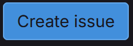
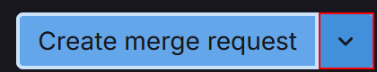
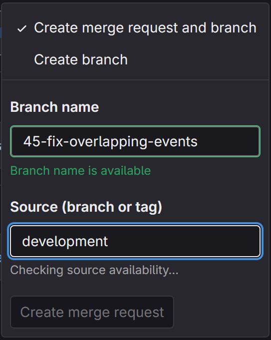

# Grunnleggende om GitLab

GitLab er et verktøy programvarepakke som kan utvikle, sikre og drive programvare. GitLab brukes ofte når flere personer skal jobbe på et prosjekt og inneholder derfor en rekke verktøy som er nyttige i en slik sammenheng.

Denne siden kommer bare til å forklare de mest grunnleggende delene av GitLab.

## Issues

Alt av utvikling med GitLab starter med å lage en ny **issue**. Naviger til issue siden i menyen på venstre side. Her kan du opprette en ny issue ved å klikke på . Fyll inn all nødvendig informasjon. Husk å være spesifik slik at det blir enklere for den som må fikse. Deretter trykk på .

Husk på å legge til **Assignee**, **Milestone**, og **Labels** for hver issue du lager.

Du har nå laget en ny issue.

## Branch

Vi pleier å lage nye **branches** fra issues. Dette er fordi branches ofte er til for å fikse et spesifikt problem, eller lage en spesifik ny egenskap til en applikasjon.

For å lage en ny branch, naviger deg inn i en issue. Klikk deretter på pilen ved siden av **Create merge request** . Du vil nå få opp en dropdown med flere valg.

Pass på at `Create merge request and branch` er valgt, gi den nye branchen et navn, velg **Source branch** og klikk `create merge request`.

---

Det går også ann å lage en ny branch uten å ha den koblet til en issue, men dette er noe en helst ikke gjør.

## Merge Requests

Når du er ferdig med å jobbe på en branch og ønsker å få endringene dine inn i orginalbranchen, må du lage en merge request. Hvis du fulgte stegene over for å lage en branch, vil merge requesten allerede være opprettet.

En merge request må gjennomgå en **code review** før den kan merges. Dette betyr at andre utviklere må se gjennom koden din og godkjenne endringene. Når merge requesten er godkjent, kan du trykke på  for å få endringene dine inn i targetbranchen.

## Anent

Etter hvert som prosjetet utvikler seg **kan** det komme andre ting i GitLab (er ikke sikkert vi trenger det). Eksempler på dette er `pipelines`, `CI/CD` konfigurasjonsfiler, mm. På dette tidspunktet er dette ikke noe vi trenger å bry oss om på dette tidspunktet.

**[Tilbake til oversikt](./README.md)**
